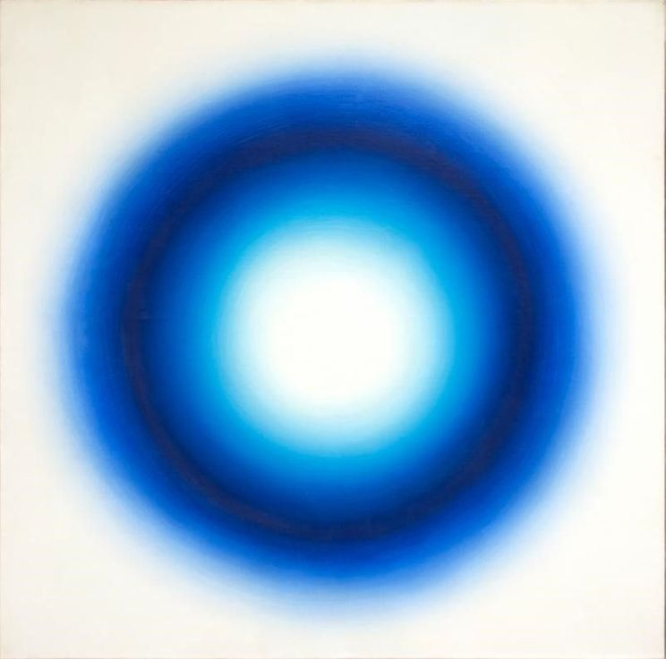

# Art projects
These projects were a part of my unsupervised learning class. For both of the projects I used a variety of paintings from different art eras. The goal was to show how unsupervised learning algorithms will deal with paintings characteristic for each of the epochs. 

----
# Clustering project
In the clustering project, I used CLARA algorithm for clustering the painting images. The conclusion drawn was that images with clear separation between and low number of colors(for example Marilyn Monroe by Andy Warhol) can be best represented with low number of clusters, while paintings where the colors overlap (for example expresionnism) confuse the algorithm. 

----
# Dimension reduction project
In this project I used PCA decomposition algorithm and tried to recreate the image using less dimensions. While for almost all paintings from different eras (renaissance, baroque, impressionism, pop art) required 32 components to faithfully represent the original, paintsing by Wojciech Fangor needed only 8/16 (painting shown below)

